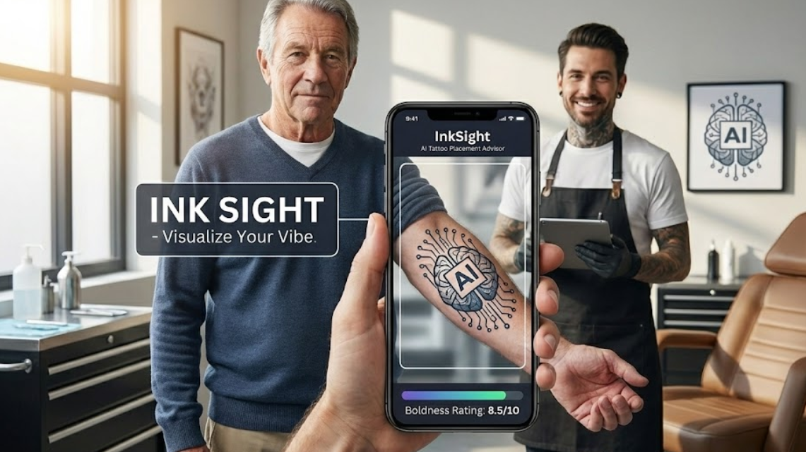

# InkSight - AI Tattoo Placement Advisor

<div align="center">
  
  
  
  
</div>

<p align="center">
  <strong>The first AI-powered advisor for tattoo enthusiasts and artists.</strong><br>
  Visualize tattoo placements on your body and get AI-powered feedback before the needle touches your skin.
</p>

<p align="center">
  <a href="demo.mp4"><strong>🎥 Watch Demo Video</strong></a>
</p>

<p align="center">
  <em>Experience the future of tattoo visualization:</em>
</p>

<p align="center">
  
</p>

---

## ✨ Features

- 🎨 **AI Tattoo Simulation** - Upload a photo and describe your tattoo vision
- 🖼️ **8+ Art Styles** - Traditional, Minimalist, Realism, Japanese, Blackwork, Fineline, Cyberpunk, Geometric
- 🔄 **Image Preprocessing** - Rotate, scale, adjust brightness/contrast, sharpen
- ↩️ **Undo/Redo History** - Full state management for your edits
- 💾 **Local Gallery** - Save and manage your tattoo simulations
- 🔐 **Your Own API Key** - Use your own Replicate API token (no account required on our end)

## � Quick Start

### 1. Clone the repository

```bash
git clone https://github.com/Jeba-Jebarsan/InkSight.git
cd InkSight
```

### 2. Install dependencies

```bash
npm install
```

### 3. Start the development server

```bash
npm run dev
```

### 4. Get your Replicate API Token

1. Go to. [replicate.com](https://replicate.com)
2. Sign up for a free account
3. Navigate to [API Tokens](https://replicate.com/account/api-tokens)
4. Create a new token
5. Enter the token in the app when prompted

That's it! The app will prompt you to enter your API token when you try to simulate.

## 🛠️ Tech Stack

- **Frontend**: React 18 + TypeScript
- **Build Tool**: Vite
- **Styling**: Tailwind CSS
- **AI Model**: Replicate API (bytedance/seedream-4 & Llama 3)
- **Storage**: LocalStorage (no backend required)

## 📁 Project Structure

```
inksight/
├── components/
│   ├── Layout.tsx        # Main layout with navigation
│   └── Simulator.tsx     # Core tattoo simulation component
├── services/
│   └── replicateService.ts  # Replicate API integration
├── App.tsx               # Main app with routing
├── types.ts              # TypeScript types
├── index.tsx             # Entry point
├── index.html            # HTML template
├── vite.config.ts        # Vite configuration
└── package.json          # Dependencies
```

## 🎯 How It Works

1. **Upload a Photo** - Take or upload a photo of the body part where you want the tattoo
2. **Describe Your Vision** - Enter a text description of your tattoo concept
3. **Choose a Style** - Select from 8+ tattoo art styles
4. **Generate** - The AI creates a visualization of your tattoo on the photo
5. **Adjust** - Fine-tune opacity, save to gallery, or try different concepts

## 🔑 API Token Security

Your Replicate API token is stored **locally in your browser** (localStorage). It is:
- ✅ Never sent to any server other than Replicate
- ✅ Only stored on your device
- ✅ Can be cleared anytime from the app

---

<div align="center">

### Ready to see how today’s choices shape tomorrow’s you?

**[Clone the repo](https://github.com/Jeba-Jebarsan/InkSight) • Run your first scan • Contribute a feature 🚀**

<br>

<p align="center">
  <a href="https://x.com/Thomas_jebarsan"></a> Made with ❤️ by <a href="https://x.com/Thomas_jebarsan">Jebarsan</a>
</p>

</div>
